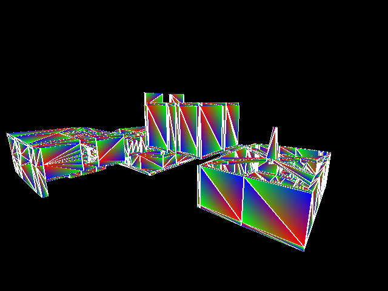

# prey95bsp

a software-rendered viewer for Prey (1995) BSP files written in C.

it can run on modern platforms with SDL2.

It requires two files from the Prey 1995 alpha: `DEMO4.BSP` and `MACT.WAD`. The alpha can be downloaded here: [archive.org](https://archive.org/details/prey-1195/)

## source files guide

- bsp.c - Prey BSP loader (`DEMO4.BSP`)
- wad.c - Prey WAD loader (`MACT.WAD`)
- main.c - Renderer using [small3dlib](https://gitlab.com/drummyfish/small3dlib)
- platform_sdl2.c - Backend code abstraction for SDL2

## thirdparty

* [small3dlib](https://gitlab.com/drummyfish/small3dlib)
* [TinyGL](https://bellard.org/TinyGL/)

## license

ANTI-CAPITALIST SOFTWARE LICENSE (v 1.4)

Copyright © 2023 erysdren (it/they/she)

This is anti-capitalist software, released for free use by individuals
and organizations that do not operate by capitalist principles.

Permission is hereby granted, free of charge, to any person or
organization (the "User") obtaining a copy of this software and
associated documentation files (the "Software"), to use, copy, modify,
merge, distribute, and/or sell copies of the Software, subject to the
following conditions:

  1. The above copyright notice and this permission notice shall be
  included in all copies or modified versions of the Software.

  2. The User is one of the following:
    a. An individual person, laboring for themselves
    b. A non-profit organization
    c. An educational institution
    d. An organization that seeks shared profit for all of its members,
    and allows non-members to set the cost of their labor

  3. If the User is an organization with owners, then all owners are
  workers and all workers are owners with equal equity and/or equal vote.

  4. If the User is an organization, then the User is not law enforcement
  or military, or working for or under either.

THE SOFTWARE IS PROVIDED "AS IS", WITHOUT EXPRESS OR IMPLIED WARRANTY OF
ANY KIND, INCLUDING BUT NOT LIMITED TO THE WARRANTIES OF MERCHANTABILITY,
FITNESS FOR A PARTICULAR PURPOSE AND NONINFRINGEMENT. IN NO EVENT SHALL
THE AUTHORS BE LIABLE FOR ANY CLAIM, DAMAGES OR OTHER LIABILITY, WHETHER
IN AN ACTION OF CONTRACT, TORT OR OTHERWISE, ARISING FROM, OUT OF OR IN
CONNECTION WITH THE SOFTWARE OR THE USE OR OTHER DEALINGS IN THE
SOFTWARE.
