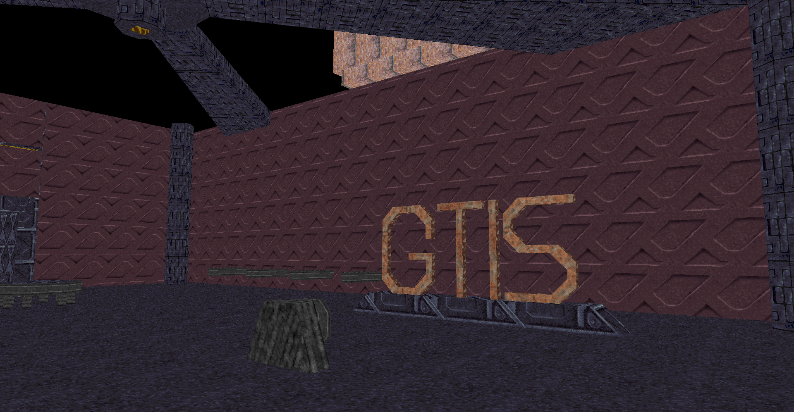

# glPrey



An OpenGL viewer for Prey (1995) BSP files written in C with SDL2.

It requires two files from the Prey 1995 alpha: `DEMO4.BSP` and `MACT.WAD`. The alpha can be downloaded here: [archive.org](https://archive.org/details/prey-1195/)

## Credits

- [Paril](https://github.com/Paril): Helped me figure out texture mapping.

## Building

In a UNIX-like environment:

```
cd glPrey/
make
```

## Notes

- Only tested on Linux so far. Additional compatibility for Windows may be needed to build.
- Texture mapping is not *quite* right, but it's close enough to look good.
- Lightmaps are still a mystery.
- If you happen to find any other BSPs or WADs from the Prey engine, you can specify them on the commandline with `--bsp` and `--wad`.

## Controls

- WASD: Move
- Shift: Speed
- Mouse: Look
- Arrow Keys: Look

## Source Files

- `bsp.c` - Prey BSP loader
- `bsp2ply.c` Prey BSP to Stanford PLY converter
- `wad.c` - Prey WAD loader
- `mip.c` - Prey MIPTEX loader
- `glprey.c` - Main GL renderer

## Todo

- DMO file playback
- Lightmaps
- Collision / gravity
- Developer console
- Windows support
- WAD extractor tool

## License

MIT License

Copyright (c) 2023 erysdren (it/she/they)

Permission is hereby granted, free of charge, to any person obtaining a copy
of this software and associated documentation files (the "Software"), to deal
in the Software without restriction, including without limitation the rights
to use, copy, modify, merge, publish, distribute, sublicense, and/or sell
copies of the Software, and to permit persons to whom the Software is
furnished to do so, subject to the following conditions:

The above copyright notice and this permission notice shall be included in all
copies or substantial portions of the Software.

THE SOFTWARE IS PROVIDED "AS IS", WITHOUT WARRANTY OF ANY KIND, EXPRESS OR
IMPLIED, INCLUDING BUT NOT LIMITED TO THE WARRANTIES OF MERCHANTABILITY,
FITNESS FOR A PARTICULAR PURPOSE AND NONINFRINGEMENT. IN NO EVENT SHALL THE
AUTHORS OR COPYRIGHT HOLDERS BE LIABLE FOR ANY CLAIM, DAMAGES OR OTHER
LIABILITY, WHETHER IN AN ACTION OF CONTRACT, TORT OR OTHERWISE, ARISING FROM,
OUT OF OR IN CONNECTION WITH THE SOFTWARE OR THE USE OR OTHER DEALINGS IN THE
SOFTWARE.
